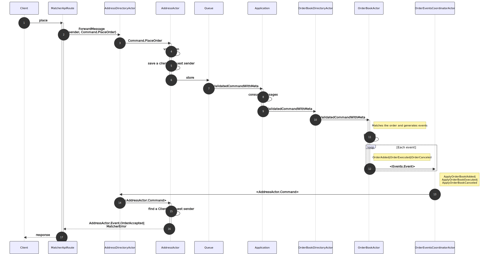
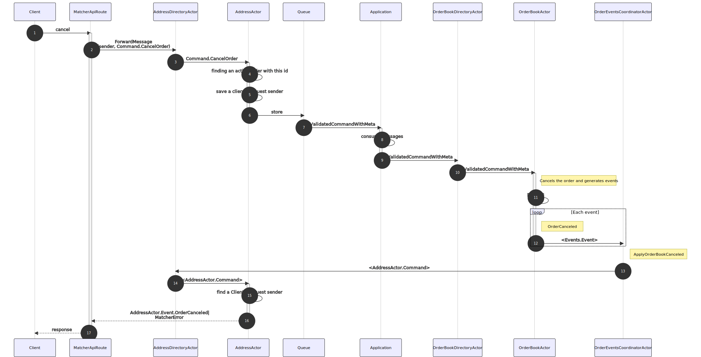

# How Matcher places and cancels orders by clients requests

The high level diagrams of how it works.

## On matcher which accepts requests

### Places

### Cancels

Works similarly:

## On other matchers

There is possible a configuration with multiple matchers. 
On a secondary matcher processing looks same, but it starts from `Application`.
