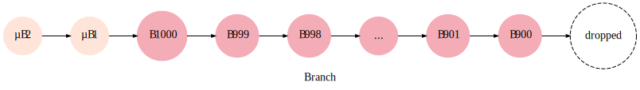

# How Matcher interacts with the Waves Node

It requires two installed extensions on the Waves Node:
* `Blockchain Updates` provides a stream of blockchain events: a block appended, a chain rolled back, etc.;
* `Matcher Extension` provides other required functionality: getting balances, a stream of UTX events, etc.

The clients of these extensions coupled. This means when one of them stops, another stops too.

## Streams

We have different event streams: 
* Blockchain;
* Utx;
* DataReceived.

To have an easier processing and reasoning benefits we merge them into a one.

## State machine

There is a state machine that describes how Matcher works with Blockchain and UTX events.
See `StatusTransitions` class for implementation details.

Matcher will not request the next blockchain event until process the previous.

Where:
* `Utx*` is `UtxAdded` and `UtxSwitched`;
* `Appended ok` is `Appended` with a valid block;
* `Appended invalid` is `Appended` with an invalid block.

Also, when we face a connection issue, we drop the latest block and generate the `RolledBack` event to get further blocks.

### Statuses

#### Normal

When we are receiving blocks and all of them follow the chain. 

When we face with an invalid block (`Appended invalid`) or a connection issue, we move to `TransientRollback`. 
This also could happen when we receive a key block, that references not the latest micro block (a micro fork), which is a normal for Waves NG. 

#### TransientRollback

Is a state, when we are trying to resolve the fork. See below about a logic of resolving forks.

When we are moving to a better fork, some transactions could not be observed on it. 
* If there are no such transactions, we can safely switch to the `Normal` status (`Appended ok ^1`).
* Otherwise, we need to request balances of accounts, those the dropped transactions affect. 
    We ask balances, switch to `TransientResolving` and wait for `DataReceived`.

#### TransientResolving

In this state we are waiting for `DataReceived`. We can switch to the `Normal` status receiving this event.

## Forks

To resolve forks we use `WavesFork` class. Note, in Waves blockchain the maximum rollback size is 100 blocks.
The last measurement showed 6-8 rollbacks with 1-2 height on MainNet during the day.

After resolving a fork, we look which addresses affected on the original, but not on the new main branch and
request their balances.

## Branches

Are represented by `WavesBranch` class. It has a limited number of blocks to preserve the memory and 
because we can't roll back more than 100 blocks.

