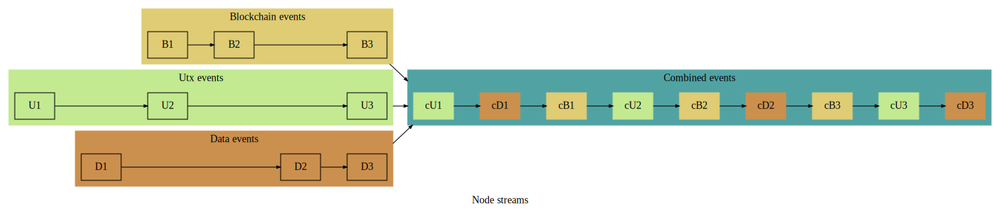
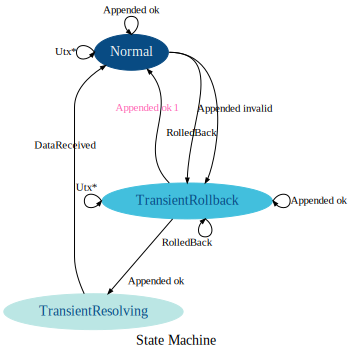
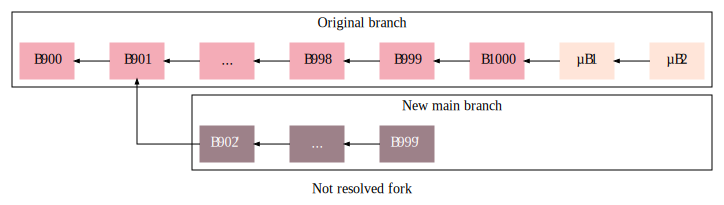
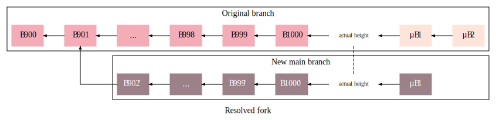
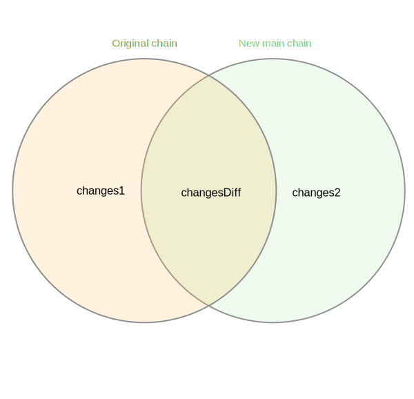
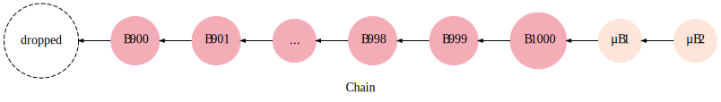

# How Matcher interacts with the Waves Node

  * [Streams](#streams)
  * [State machine](#state-machine)
     * [Statuses](#statuses)
        * [Normal](#normal)
        * [TransientRollback](#transientrollback)
        * [TransientResolving](#transientresolving)
  * [Forks](#forks)
  * [Chains](#chains)

It requires two installed extensions on the Waves Node:
* `Blockchain Updates` provides a stream of blockchain events: a block appended, a chain rolled back, etc.;
* `Matcher Extension` provides other required functionality: getting balances, a stream of UTX events, etc.

The clients of these extensions coupled. This means when one of them stops, another stops too.



## Streams

We have different event streams: 
* Blockchain;
* Utx;
* DataReceived is a synthetic stream of manually requested balances. See `TransientResolving` below.

To have an easier processing and reasoning benefits we merge them into a one.



## State machine

There is a state machine that describes how Matcher works with Blockchain and UTX events.
See `StatusTransitions` class for implementation details.

Matcher will not request the next blockchain event until process the previous.



Where:
* `Utx*` is `UtxUpdated` and `UtxSwitched`;
* `Appended ok` is `Appended` with a valid block;
* `Appended invalid` is `Appended` with an invalid block.

Also, when we face a connection issue, we drop the latest block and generate the `RolledBack` event to get further blocks.

### Statuses

#### Normal

When we are receiving blocks and all of them follow the chain. 

When we face with an invalid block (`Appended invalid`) or a connection issue, we move to `TransientRollback`. 
This also could happen when we receive a key block, that references not the latest micro block (a micro fork), which is a normal for Waves NG. 

#### TransientRollback

Is a state, when we are trying to resolve the fork. See below about a logic of resolving forks.

When we are moving to a better fork, some transactions could not be observed on it. 
* If there are no such transactions, we can safely switch to the `Normal` status (`Appended ok ^1`).
* Otherwise, we need to request balances of accounts, those the dropped transactions affect. 
    We ask balances, switch to `TransientResolving` and wait for `DataReceived`.

#### TransientResolving

In this state we are waiting for `DataReceived`. We can switch to the `Normal` status receiving this event.

## Forks

To resolve forks we use `WavesFork` class. Note, in Waves blockchain the maximum rollback size is 100 blocks.
The last measurement showed 6-8 rollbacks with 1-2 height on MainNet during the day. 
So it should not be a big issue for us.



The fork resolves when we:
* receive the last known micro block if we are on the same chain (e.g. rolled back after a disconnect);
* receive a micro block if we are on a different chain.

The second case is more interesting. Why did we wait for a micro block? 

At first, a Node can't switch to a chain with a lesser number of blocks (from a Node's team):
```
A chain with one block: score_1 = X / baseTarget_0
A chain with two blocks: score_2 = X / bt_1 + X / bt_2 = X (bt_1 + bt_2) / (bt_1 * bt_2)

score_1 > score_2  ==>
X / bt_0 > X (bt_1 + bt_2) / (bt_1 * bt_2) ==>
1 / bt_0 > (bt_1 + bt_2) / (bt_1 * bt_2) ==>
bt_0 < (bt_1 * bt_2) / (bt_1 + bt_2)

baseTarget is calculated based on gap between previous blocks, so bt_0 have to be bt_1. Then:

bt_0 * (bt_0 + bt_2) < bt_0 * bt_2
bt_0 ^ 2 < 0 

This could not happen.
```

So, if we wait for the height of the previous chain, we wait the latest block.
Waiting a micro block saves us from a balance flickering.



After resolving a fork, we look which addresses affected on the original, but not on the new main chain and
request their balances.



Where `changesDiff` is addresses and assets which we have to request from the Node.

Most time `changes1` will be equal to `changes2`, so we don't see any difference.  

## Chains

Are represented by `WavesChain` class. It has a limited number of blocks to preserve the memory and 
because we can't roll back more than 100 blocks.


